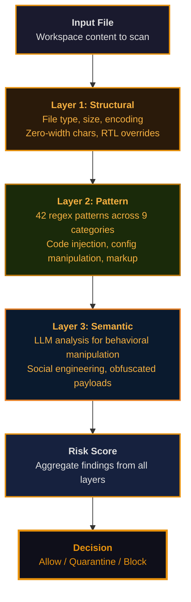

# Architecture

Open Workspace Builder is structured as a composable library with three core subsystems: workspace initialization, configuration management, and security scanning. This architecture enables both standalone CLI usage and integration into downstream applications.

## Workspace Structure

`owb init` creates a standardized workspace directory with three main sections:

**Configuration and Entry Points** (`.ai/`):
- `WORKSPACE.md` — Single entry point for workspace configuration, loaded by Claude and other AI tools

**Skills and Automation** (`.skills/`):
- Custom skills directory for user-defined commands and workflows

**Knowledge and Context** (`Context/`):
- `about-me.md`, `brand-voice.md`, `working-style.md` — User identity and communication preferences
- `Obsidian/` — Structured knowledge vault with decision logs, project state, processed research, development policies, and business strategy

When ECC is enabled (`ecc.enabled: true`), a `.claude/` directory is generated with executable agents, command definitions, and policy rules that extend the base workspace.

## Configuration System

OWB uses a three-layer overlay system: built-in defaults form the base, then user configuration (`~/.owb/config.yaml`) overrides them, and finally CLI flags override both layers. Any key you omit falls back to the layer below.

Configuration covers vault structure, ECC setup, custom skills, agent behavior, language models, security policies, trust settings, marketplace integrations, file paths, and context templates.

## Name-Aware CLI

OWB resolves config file paths from the binary name: `owb` reads `~/.owb/config.yaml`, `cwb` reads `~/.cwb/config.yaml`. This pattern enables downstream vendors to wrap OWB, use their own configuration namespace, and share OWB's underlying engine and infrastructure.

## Security Scanner Architecture

The security scanner operates in three layers of defense-in-depth:

Layer 1 catches structural anomalies that indicate suspicious formatting. Layer 2 identifies known attack patterns across code injection, configuration manipulation, and markup-based attacks. Layer 3 uses semantic analysis to detect novel or disguised threats that bypass pattern matching.

## Library Architecture

OWB is built as a first-class library, not just a CLI tool. Downstream packages depend on OWB as a dependency, provide their own pre-baked workspace configuration, register custom CLI entry points, and leverage OWB's core subsystems: the workspace engine, security scanner, and evaluator infrastructure.

This design enables vendors to build specialized workspaces (domain-specific skills, branded policies, custom integrations) while inheriting OWB's proven initialization, configuration, and security foundations.
