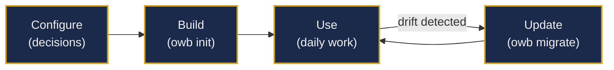

# How It Works

OWB sets up your AI coding workspace in three steps: configure your preferences, build the workspace, and keep it current as your projects evolve.

## Step 1: Configure

Before building, you make four decisions that shape your workspace. The setup wizard (`owb setup`) walks you through each one interactively, or you can write a `config.yaml` file in advance.

**Model provider:** Which LLM provider to use for security scanning and content evaluation. Options include Anthropic, OpenAI, Ollama (local), or any LiteLLM-compatible provider.

**Vault structure:** Whether to scaffold a new Obsidian vault from templates or integrate with an existing vault using `--from-vault`. New vaults get the complete template structure (projects, research, decisions, business context). Existing vaults receive only the missing pieces.

**ECC enablement:** Whether to install the Everything Code Catalog — a curated set of agents, commands, and project rules that extend the base workspace with development workflow automation.

**Skills and security layers:** Which skills to install and how aggressively to scan incoming content. Security scanning ranges from fast pattern matching (Layer 1) to full LLM-powered semantic analysis (Layer 3).

## Step 2: Build

Running `owb init` produces a complete workspace from your configuration.

**Config resolution:** OWB merges built-in defaults with your config file and any CLI overrides into a single effective configuration.

**Vault scaffolding:** Directories are created for projects, research, decisions, and business context. A `_bootstrap.md` file is generated as the single entry point — it tells the AI agent every active project's current phase and next action.

**Context file deployment:** Three foundational files (`about-me.md`, `brand-voice.md`, `working-style.md`) are written to the workspace root. These establish your identity and operating preferences so the AI agent can calibrate its behavior from the first session.

**ECC installation (if enabled):** Agents, commands, and project rules are copied to the workspace. An agent config file is generated that points the AI agent to the bootstrap and project state files.

**Skills installation:** Selected skills are deployed with versioning metadata so `owb eval` can track quality and `owb update` can refresh them safely.

After the build completes, an AI agent can open a session in the workspace and immediately understand the full project landscape without any manual explanation.

## Step 3: Keep Current

As your projects evolve, OWB helps you keep the workspace synchronized.

**Drift detection:** Run `owb diff` to see where your workspace has diverged from the current OWB templates. This catches outdated rules files, missing policies, and template changes you have not applied yet.

**Interactive migration:** When drift is detected, `owb migrate` walks through each change and lets you accept or reject it. Use `--accept-all` for trusted environments. Every accepted file is security-scanned before it lands in your workspace.

**Upstream updates:** Pull new skills, templates, or policies from upstream sources with `owb update <source>`. OWB handles version resolution, dependency checks, and supply chain validation.

**Security scanning:** Before accepting third-party content, `owb security scan` validates it against pattern rules and behavioral analysis. Suspicious content is quarantined, not silently installed.

## A Typical Week

A user manages three active projects: a CLI tool in alpha, a web app shipping to production, and a research initiative in early planning.

**Monday morning:** The user starts an AI coding session. The agent reads the bootstrap file and immediately knows the state of all three projects — current blockers, next actions, and recent decisions. No context-setting conversation needed.

**Monday afternoon:** Working on the CLI tool, the agent loads the project's status and architecture files, checks the decision index for relevant patterns, and writes code following established conventions. At session end, it updates the project status and writes a session log.

**Wednesday:** The user switches to research. The agent processes raw findings from the research inbox, tags them by project, and surfaces relevant items for review.

**Thursday evening:** Running `owb diff` reveals that one project's testing rules have drifted from the current template. `owb migrate --accept-all` brings it in line.

**Friday:** A new skill becomes available upstream. The user runs `owb eval` to score it, then `owb update` to pull it in. The security scanner validates it before installation.

By week's end, all three projects are synchronized, documented, and ready for the next phase.
