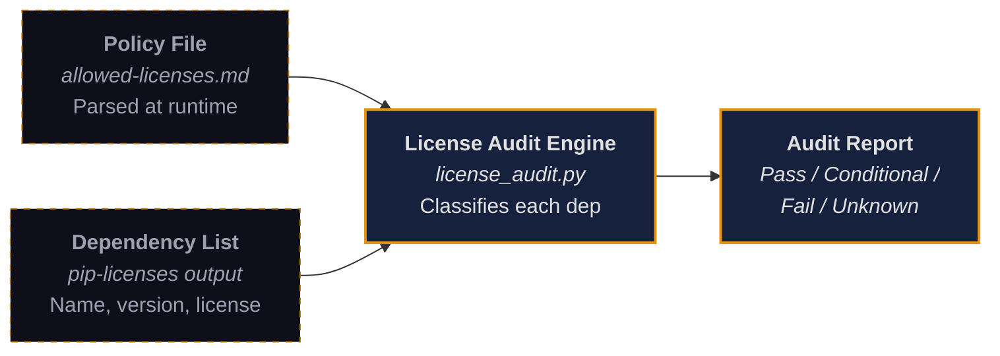

# License Compliance

OWB enforces a strict license compliance policy across all dependencies: no copyleft license may create an obligation to disclose proprietary source code, restrict commercial use, or impose compliance requirements that are easy to accidentally violate. This page explains the governing philosophy, the technical enforcement mechanism, the classification tables, and the exceptions framework.

## Philosophy: Zero IP Encumbrance

The core principle is simple: every dependency in an OWB-built workspace must be safe to ship in a proprietary product without triggering disclosure obligations. This rules out strong copyleft licenses (GPL, AGPL) that require derivative works to carry the same license, weak copyleft licenses (LGPL) that impose dynamic linking and relinking requirements, and network copyleft licenses (AGPL, SSPL) that extend obligations to server-side use.

Permissive licenses (MIT, Apache 2.0, BSD) impose only a copyright notice requirement and are always allowed. Conditional licenses (MPL 2.0, BSL) are allowed when their specific conditions do not apply to the use case.

This policy applies to both direct and transitive dependencies. A single copyleft dependency deep in the dependency tree can encumber the entire project. The license audit command checks the full tree, not just top-level packages.

## How the License Audit Works

The `owb audit licenses` command checks every installed dependency against the allowed-licenses policy. The system has three components:



**Policy parsing.** The engine reads `content/policies/allowed-licenses.md` at runtime and extracts three category tables: Allowed, Conditional, and Disallowed. License lists are never hardcoded in source code. If the policy file is updated (a new license added or a category changed), the next audit run reflects the change without a code deployment.

**Dependency discovery.** The engine runs `pip-licenses --format=json` (via subprocess) to enumerate every installed package with its declared license. This covers both direct and transitive dependencies.

**Classification.** Each dependency's license string is compared against the policy categories using case-insensitive matching with alias support. "MIT License", "MIT", and "mit" all match. "Apache-2.0" and "Apache 2.0" both match. The classifier handles the variation that package registries introduce in license naming.

**Verdict.** Each dependency receives one of four statuses:

| Status | Meaning | Exit Code |
|--------|---------|-----------|
| **Pass** | License is in the Allowed table | 0 |
| **Conditional** | License is in the Conditional table; condition text is shown | 2 |
| **Fail** | License is in the Disallowed table | 1 |
| **Unknown** | License not found in any table; requires manual review | 1 |

Unknown licenses are treated as failures, not passes. An unrecognized license string is a signal that the dependency needs human evaluation before adoption.

## Classification Tables

### Allowed (Permissive)

These licenses impose no meaningful restrictions beyond copyright notice inclusion.

| License | Notes |
|---------|-------|
| MIT | Most common. No restrictions beyond copyright notice. |
| Apache 2.0 | Explicit patent grant and retaliation clause. Preferred over MIT when available. |
| BSD 2-Clause | Functionally equivalent to MIT. |
| BSD 3-Clause | Adds a no-endorsement clause. |
| ISC | Simplified BSD/MIT equivalent. Common in the Node.js ecosystem. |
| CC0 / Public Domain / Unlicense | No restrictions whatsoever. |
| 0BSD | Zero-clause BSD. No notice requirement. |

### Allowed with Conditions

Safe when used as intended, but the developer must verify the condition does not apply.

| License | Condition |
|---------|-----------|
| MPL 2.0 | File-level copyleft. Modifications to MPL-licensed source files must be released. Using the library unmodified creates no obligation. |
| BSL (Business Source License) | Read the "Additional Use Grant" in each BSL project. Typically restricts competing hosted services, which does not apply to infrastructure use. Converts to permissive after the change date. |
| Artistic License 2.0 | Permissive in practice. Unusual language but low risk. Rarely encountered outside Perl. |

### Disallowed (Copyleft / Commercial Restriction)

These licenses create IP encumbrance risk and must not be used as linked dependencies.

| License | Risk |
|---------|------|
| GPL v2 / v3 | Strong copyleft. Linking requires the entire application to be distributed under GPL. |
| AGPL v3 | Network copyleft. SaaS use requires releasing the entire application source. |
| LGPL v2.1 / v3 | Weak copyleft. Requires dynamic linking and relinking ability. Disallowed for simplicity. |
| SSPL | Requires open-sourcing the entire service stack (monitoring, backups, orchestration). |
| CC BY-NC | Explicitly prohibits commercial use. |
| CC BY-SA | Copyleft for content. Derivative works must use the same license. |
| Commons Clause | Restricts sale of the software. Ambiguously worded. |
| EUPL | Complex copyleft with broad compatibility claims. |

## The CLI Tool Exemption

Copyleft obligations are triggered by linking — importing a library into a process so that it becomes part of the interpreted program. Invoking a separately installed CLI tool via subprocess does not constitute linking. The calling program and the CLI tool run in separate processes with no shared address space, so copyleft obligations do not propagate.

OWB formalizes this distinction with an **External CLI Tool Invocation** exemption. A tool with a Disallowed license can be used if all four conditions hold:

1. The tool is invoked only via `subprocess.run()` or equivalent, never imported as a library
2. The tool is installed separately (system package, pipx, standalone binary), not bundled in the distribution
3. No project source code patches or modifies the tool's source
4. The tool's output is not itself copyleft-encumbered (some licenses have output clauses)

When relying on this exemption, the tool must be recorded in the policy's exemption table and backed by an architectural decision record.

### Current Exemptions

| Tool | License | How Used | Decision |
|------|---------|----------|----------|
| Semgrep | LGPL-2.1 | `subprocess.run()` in `security/sast.py` for static analysis | DRN-047 / AD-17 |

**Why Semgrep.** OWB needed a SAST engine for detecting insecure code patterns (SQL injection, path traversal, shell injection) in evaluated components. Semgrep is the most capable open source option with the broadest rule coverage. Its LGPL-2.1 license would be disallowed as a library import, but OWB's subprocess invocation does not trigger any copyleft obligation. A CI guard (`grep` for `import semgrep` in source files) prevents future maintainers from accidentally converting the subprocess call to a library import.

## Using the Audit

### Standalone license check

```bash
owb audit licenses                      # text output
owb audit licenses --format json        # structured output
owb audit licenses --policy path/to/allowed-licenses.md  # custom policy file
```

### Combined with dependency audit

```bash
owb audit deps --licenses               # vulnerability scan + license check
```

### In CI

The license audit returns exit code 1 on any Fail or Unknown finding. Add it to your CI pipeline to catch disallowed dependencies before they reach production:

```yaml
- name: License compliance check
  run: owb audit licenses --format json --output license-report.json
```

## Enforcement in the Agent Context

The license policy is not just a document — it is enforced through the inline policy rules deployed to the workspace's rules directory. When ECC is enabled, the AI agent's context includes these enforceable checklist items:

- "License check passes before health evaluation (disallowed license = stop)"
- "Dependency license checked before adding (Allowed = proceed; Conditional = verify condition; Disallowed or unlisted = find alternative)"
- "No GPL, AGPL, LGPL, SSPL, Commons Clause, or CC-NC/CC-SA licensed code without a documented exception"

When a developer asks the agent to add a dependency, the agent checks the license before proceeding. If the license is disallowed, the agent stops and explains why. The developer does not need to remember the policy — the agent enforces it in context.
