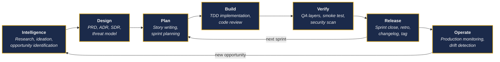
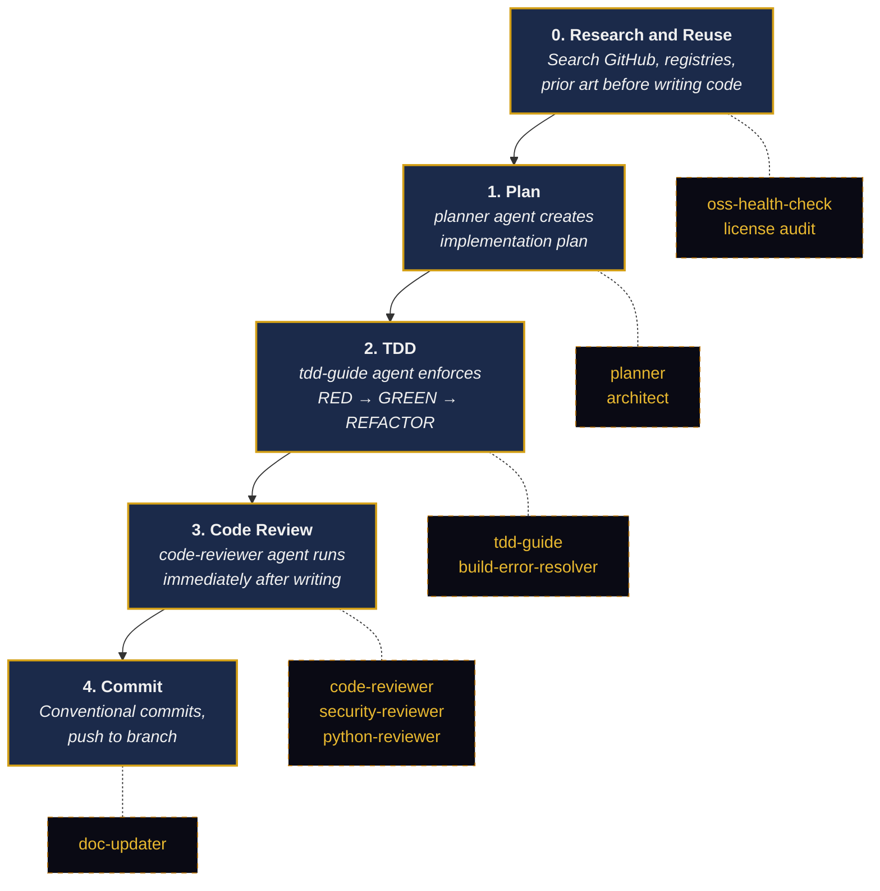
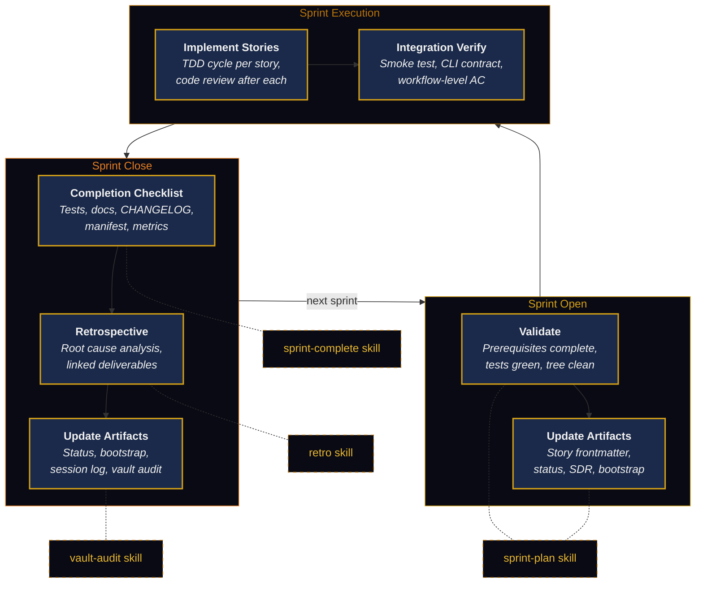
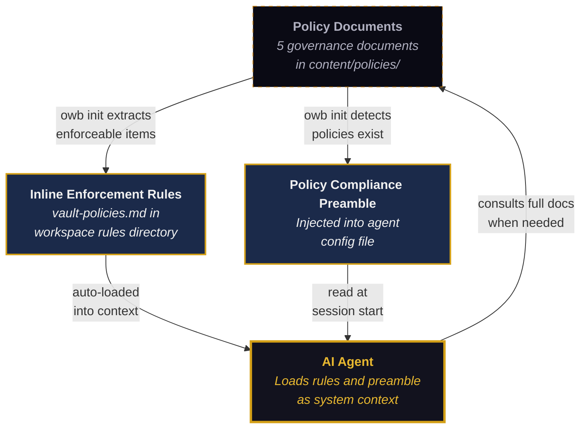

# Lifecycle, Agents, and Policy Enforcement

OWB ships a set of governance policies, ECC agents, and orchestration skills that together form a complete product development process. The policies define what must happen at each phase. The agents and skills execute those policies automatically, triggered by the natural context of the work at hand. The developer does not need to remember the process — the agents enforce it.

This page explains how the product lifecycle, software development lifecycle, agent catalog, and policy enforcement rules connect to each other.

## Product Lifecycle

The product lifecycle defines the phases a project moves through from concept to production. Each phase produces specific artifacts and has specific quality gates.

Each phase maps to specific governance documents, agent capabilities, and quality gates:

| Phase | Governance Document | Key Agents and Skills | Quality Gate |
|-------|-------------------|----------------------|-------------|
| Intelligence | product-development-workflow | mobile-inbox-triage | Research tagged and processed |
| Design | product-development-workflow | architect, planner | PRD, ADR, SDR, threat model complete |
| Plan | development-process | write-story, sprint-plan | Stories have workflow-level AC |
| Build | development-workflow, testing | tdd-guide, code-reviewer, build-error-resolver | Tests green, 80%+ coverage |
| Verify | integration-verification-policy | security-reviewer, e2e-runner | Smoke test passes, CLI contract verified |
| Release | development-process | sprint-complete, retro, doc-updater | Checklist complete, retro filed |
| Operate | oss-health-policy, allowed-licenses | vault-audit, oss-health-check | Drift detected and resolved |

## Software Development Lifecycle

Within the Build phase, each feature follows a strict development workflow. The ECC rules file `development-workflow.md` defines four sequential steps, each backed by a specific agent.

The agents are not called by a central orchestrator. They are triggered naturally by the ECC rules loaded into the AI agent's context. When the rules file says "use **tdd-guide** agent" for new features, the AI agent invokes it because that instruction is part of its active system prompt. The developer does not need to remember which agent to call — the rules make it automatic.

## Sprint Lifecycle

A sprint is the unit of delivery. The sprint-plan skill orchestrates the documentation updates at both ends of a sprint — opening and closing — while the sprint-complete and retro skills handle the quality gates at close.

## How Policy Enforcement Works

The connection between governance policies and agent behavior happens through three layers:

**Layer 1: Policy documents** live in `content/policies/` and are deployed to the vault's `code/` directory during `owb init`. These are the full, detailed governance documents — the product development workflow, sprint mechanics, integration verification standards, OSS health evaluation criteria, and allowed license lists.

**Layer 2: Inline enforcement rules** are extracted from the policy documents into a compact checklist (`vault-policies.md`) that is deployed to the workspace's rules directory. The AI agent loads this file automatically as part of its system context. Each checklist item is an enforceable gate — the agent checks these before proceeding with work.

**Layer 3: A policy compliance preamble** is injected into the generated workspace config file (the agent's entry point). This preamble instructs the agent to follow the enforcement rules and escalate conflicts to the owner rather than proceeding silently.

The enforcement rules contain checklist items like:

- "PRD, ADR, SDR, and threat model exist before implementation begins"
- "Acceptance criteria describe end-to-end operator workflows, not isolated module behavior"
- "License check passes before health evaluation (disallowed license = stop)"

When an AI agent begins work on a feature, these rules are already in its context. If the agent is asked to implement a story without a PRD, the enforcement rules instruct it to flag that gap. If a dependency is being added, the rules require a license check and health evaluation before proceeding. The agent does not need a separate compliance workflow — the rules are part of every session.

## Agent Catalog

The ECC ships 16 agents, 15 commands, and 7 skills. Each is designed for a specific phase of the lifecycle.

### Agents (Specialized Sub-Processes)

| Agent | Lifecycle Phase | What It Does |
|-------|----------------|-------------|
| **planner** | Plan | Creates implementation plans, identifies dependencies and risks |
| **architect** | Design | System design, C4 modeling, architectural decisions |
| **tdd-guide** | Build | Enforces RED → GREEN → REFACTOR cycle, 80%+ coverage |
| **code-reviewer** | Build | Reviews code for quality, security, maintainability |
| **python-reviewer** | Build | Python-specific PEP 8, type hints, security review |
| **go-reviewer** | Build | Go-specific idiomatic patterns, concurrency safety |
| **security-reviewer** | Verify | OWASP Top 10, secrets detection, injection prevention |
| **build-error-resolver** | Build | Fixes build errors, type errors, linter warnings |
| **e2e-runner** | Verify | End-to-end testing with browser automation |
| **doc-updater** | Release | Updates documentation, READMEs, codemaps |
| **refactor-cleaner** | Build | Dead code removal, consolidation, cleanup |
| **database-reviewer** | Build | PostgreSQL query optimization, schema review |
| **harness-optimizer** | Build | Agent harness configuration optimization |
| **loop-operator** | Build | Autonomous agent loop monitoring and intervention |
| **chief-of-staff** | Operate | Communication triage across channels |

### Skills (Orchestration Workflows)

| Skill | Lifecycle Phase | What It Does |
|-------|----------------|-------------|
| **sprint-plan** | Plan / Release | Automates sprint open and close artifact updates |
| **sprint-complete** | Release | Walks through the sprint completion checklist |
| **retro** | Release | Scaffolds retrospectives with sequential IDs |
| **write-story** | Plan | Generates story files with workflow-level AC |
| **vault-audit** | Operate | Checks vault integrity (links, indexes, frontmatter) |
| **oss-health-check** | Build | Evaluates dependency health against scoring criteria |
| **mobile-inbox-triage** | Intelligence | Processes mobile research captures |

### Commands (One-Line Triggers)

Commands are shorthand for common operations: `/plan`, `/tdd`, `/code-review`, `/verify`, `/build-fix`, `/test-coverage`, `/e2e`, `/eval`, `/checkpoint`, `/update-docs`, `/refactor-clean`, `/python-review`, `/go-review`, `/go-build`, `/go-test`.

## End-to-End Example

A developer working with OWB and an AI agent experiences the full lifecycle without needing to remember the process:

1. **Research phase:** The developer captures an idea on mobile. The mobile-inbox-triage skill processes it into a tagged research note.

2. **Design phase:** The developer says "let's design this." The agent invokes the architect and planner agents, checks the decisions index for prior art, and produces PRD, ADR, SDR, and threat model using vault templates.

3. **Sprint planning:** The developer says "open Sprint 5 with stories S030 through S035." The sprint-plan skill validates prerequisites, updates story frontmatter, status.md, SDR, and bootstrap in one pass.

4. **Implementation:** The developer says "implement S030." The agent reads the story's acceptance criteria, invokes the tdd-guide to write tests first, implements the code, then automatically triggers the code-reviewer. If a new dependency is needed, the enforcement rules require `owb audit package` before installation and `owb audit licenses` before adoption.

5. **Sprint close:** The developer says "close the sprint." The sprint-complete skill runs the checklist (tests, docs, CHANGELOG, manifest). The retro skill scaffolds a retrospective with the correct sequential ID and carried-forward items. The vault-audit skill checks for broken links from the bulk edits. A session log is written to the project's sessions folder.

6. **Operation:** Between sprints, `owb diff` detects template drift. `owb migrate` applies updates. The vault-audit skill catches stale references. The oss-health-check skill re-evaluates dependencies when their maintenance signals change.

At no point does the developer consult a process document or remember which agent to call. The policies are in the agent's context. The agents trigger based on the work at hand. The skills orchestrate multi-file updates that would otherwise require manual coordination across a dozen vault files.
