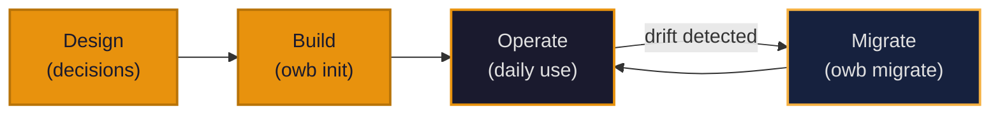

# Design to Operate: The OWB Workflow

The Open Workspace Builder takes you from zero to a fully operational Claude-integrated workspace in three phases: design your workspace structure, build it with `owb init`, and operate it day-to-day as your projects evolve.

## Phase 1: Design

Before running `owb init`, you make four critical decisions that shape how your workspace operates.

**Model provider selection:** Choose where your Claude sessions will connect—Anthropic (recommended for production), OpenAI for compatibility, Ollama for local development, or others. This setting flows into every session configuration.

**Vault structure:** Decide whether to scaffold a new Obsidian vault from templates or integrate with an existing vault using `--from-vault`. New vaults start with the complete template structure (projects, research, decisions, business); existing vaults receive only missing directories and bootstrap content.

**ECC enablement:** Enable Extended Claude Code (ECC) integration if you plan to use Claude Code as your primary development environment. This installs agents, custom commands, and project rules into `.claude/` alongside your vault, creating a seamless IDE-vault feedback loop.

**Skills and security layers:** Select which skills to install (or choose defaults for your use case). Configure security scanner layers—pattern matching, dependency checks, or full supply chain validation—based on your risk tolerance.

The setup wizard walks you through these interactively on first run, or you can write `config.yaml` in advance and pass it to `owb init`.

## Phase 2: Build

Running `owb init` executes a deterministic build sequence that transforms your decisions into a live workspace.

**Config resolution:** The tool merges defaults with your config file and any CLI overrides, creating the effective configuration for this workspace.

**Vault scaffolding:** Directories are created for projects, research, decisions, and business context. The `_bootstrap.md` file is generated—this becomes your single entry point that tells Claude every active project's current phase and next action.

**Context file deployment:** Three foundational files (`about-me.md`, `brand-voice.md`, `working-style.md`) are written to the workspace root. These establish your voice and operating preferences; Claude reads them on every session start.

**ECC installation (if enabled):** Agents, commands, and project-specific rules are copied from the OWB skeleton to `.claude/` in your workspace. This includes the auto-generated `CLAUDE.md` that points Claude to bootstrap and project state files.

**Skills installation:** Your selected skills are deployed to `.skills/` with versioning metadata so `owb eval` can track health and `owb update` can refresh them safely.

**Entry point generation:** A top-level `CLAUDE.md` (or `WORKSPACE.md`) is written, serving as the handoff point between filesystem and Claude's session start.

After build completes, Claude can open a session in your workspace and start working immediately. On first session start, Claude reads the entry point file, follows its pointers to bootstrap and project state, and understands the full landscape without you having to explain it.

## Phase 3: Operate

Day-to-day operation revolves around keeping your workspace synchronized as projects evolve.

**Weekly drift detection:** Run `owb diff` to detect configuration or template drift. This catches cases where a project's rules file has diverged from the current template, or where a security policy has updated but not been applied.

**Interactive migration:** When drift is detected, `owb migrate` presents changes and applies them interactively, or use `--accept-all` for trusted environments. This keeps all projects aligned with current best practices.

**Upstream updates:** Use `owb update <source>` to pull new skills, templates, or policies from upstream (e.g., from a Volcanix-maintained policy repository). The tool handles version resolution and dependency updates.

**Security scanning:** Before accepting third-party content (new skills, policy repositories, or downloaded templates), run `owb security scan` to validate supply chain integrity and flag policy violations.

**Quantitative skill evaluation:** When considering a new skill, use `owb eval` to score it against your standards (maintenance cadence, bus factor, license compliance). This ensures skills meet your quality bar before installation.

As the workspace grows, the vault accumulates:
- New projects are scaffolded from templates, pre-configured with status tracking and session logging.
- Decisions accumulate in the decision index, creating an audit trail of architectural choices.
- Research flows through an inbox pipeline (raw items → processed notes → project tags).
- Session logs create a queryable history of work done and decisions made.

## What This Looks Like in Practice

A user manages three active projects: a CLI tool (Phase 2: Alpha), a web app (Phase 3: Shipping), and a research initiative (Phase 1: Planning). Here's a typical week:

**Monday morning:** The user starts a Claude session in the workspace. Claude reads `CLAUDE.md`, finds `Obsidian/_bootstrap.md`, and immediately knows the state of all three projects, their current blockers, and next actions. No explanation needed.

**Monday afternoon:** The user works on the CLI tool. Claude loads the tool's `status.md` and `architecture.md`, checks the decision index for relevant architectural patterns, and writes code following the project's established conventions. At session end, Claude updates the project's status file and writes a session log.

**Wednesday morning:** The user switches to the web app research. Claude loads the research project's inbox folder, processes raw findings, tags them with `projects: web-app`, and surfaces them for review.

**Thursday evening:** Running `owb diff` reveals that one project's testing configuration has drifted from the template (the team updated their test coverage threshold last month). `owb migrate --accept-all` brings it in line.

**Friday afternoon:** A new skill becomes available from upstream. The user runs `owb eval` on it, sees the score, and if satisfied, uses `owb update` to pull it in. `owb security scan` validates it before it's integrated into the workspace.

By week's end, all three projects are synchronized, documented, and ready for the next phase.
